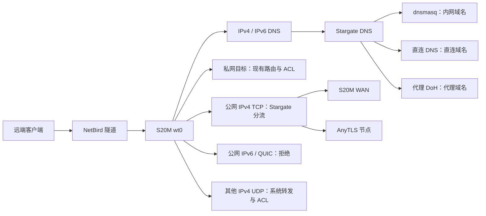

# NetBird 出口与 Stargate

状态：Stargate 数据面基础已实现并部署 S20M；新的 NetBird exit node 尚未发布，远端选择出口后的端到端验收尚未完成。

## 目标与路径

出差设备选择 S20M 为 NetBird 出口后，公网访问使用与 LAN 相同的 Stargate 分流策略。黑名单模式下，直连目标从 S20M 的 WAN 出口访问，代理目标经 AnyTLS 节点访问。因此不同网站可能看到不同的出口地址。

这提供“通过 S20M 接入 Stargate 分流”的出口。一般 UDP 尚不经 AnyTLS，公网 IPv6 也尚未代理；需要所有协议统一从代理节点出站时，必须另行实现 UDP/IPv6 数据面，不能只发布一条默认路由。

## 已实现的数据面

- 透明代理与 `inbound.netbird_proxy=1` 时，同时管理 LAN 和 `inbound.netbird_interface`（默认 `wt0`）。
- IPv4 TCP 的公网目标进入 sing-box；防火墙只提前绕过私网/保留地址，避免公网 CIDR 覆盖域名代理策略。
- 两个地址族的 TCP/UDP 53 都进入 Stargate DNS。NetBird 发给本路由器地址的 53 端口同样接管；发给其他私网 DNS 的查询保持既有路径。
- IPv6 DNS 使用绑定 LAN 地址的 `dns6-in`，nft DNAT 到同一个地址和端口，优先使用稳定 ULA。通配 `::` 监听配合 REDIRECT 在多地址 LAN 上会选错 UDP 回复源地址，不能替换为这种写法。
- LAN 接口变化触发 Stargate reload，以更新 IPv6 DNS 绑定。若启用了 IPv6、但 LAN 没有可绑定的 global-scope 地址，透明 DNS 配置预检失败，等待 LAN 就绪后重试。
- nft 的 `prerouting` NAT 优先级为 `-110`；`guard` 位于 PREROUTING `-10`，在所有常规 DNAT hook 之后。不能将 filter guard 插在 NAT 优先级之间，否则在 S20M 上可能在 DNS 完成 DNAT 前误拒绝公网 IPv6 DNS。guard 保留回复流量、本机 INPUT、NetBird 私网访问和本地 IPv6，拒绝其余受管公网 IPv6 与 UDP/443。
- NetBird 0.72.4 会向其他服务的 INPUT/FORWARD filter 链自动插入接受规则，并监视新建链。将 guard 留在 FORWARD，即使每次重建 Stargate 表也会再次被绕过；PREROUTING guard 避开了这个机制。依据：[对应版本源码](https://github.com/netbirdio/netbird/blob/v0.72.4/client/firewall/nftables/router_linux.go)。

Stargate 的 return 只结束自己的链；NetBird ACL 和 OpenWrt 防火墙仍然决定授权。IPv4 TCP 重定向后走本机 INPUT，不能把“已有出口 FORWARD 权限”当成“已有代理入口权限”。

## 控制台配置设计（尚未执行）

1. 建立专用 `stargate-exit-clients` 客户端组和 `stargate-exit-router` 路由器组，后者只包含 S20M。客户端分发组排除 S20M 及其他出口路由器，避免形成出口互指。
2. 为 S20M 发布 `0.0.0.0/0` exit route，启用 Masquerade；先关闭 Auto Apply，只让测试客户端手动选择。现有私网路由保持独立，不删除其他路由器的出口。
3. 按实际部署的 NetBird 版本核对 IPv6 默认路由。较新版本在支持 IPv6 的出口上会同时下发 `::/0`；远端必须避免 IPv6 绕过隧道，进入 S20M 的公网 IPv6 则由 Stargate guard 拒绝。参考：[NetBird exit node 文档](https://docs.netbird.io/use-cases/remote-access/exit-nodes)。
4. 配置出口访问策略；另外允许测试客户端访问 S20M 的 TCP 透明入口端口和 TCP/UDP DNS 入口端口。当前默认是 TCP/12345、TCP/UDP/1053。需要对 DNAT 后的 INPUT 路径单独验收，而非增加整接口的无条件放行。参考：[NetBird 路由与本机访问权限](https://docs.netbird.io/manage/networks/how-routing-peers-work)。
5. 为测试客户端组配置 DNS nameserver：`S20M_NETBIRD_IP:53`，匹配域 `ALL`。保留 NetBird 自身 peer 域名解析，不把此 nameserver 分发给 S20M 自己，避免系统 DNS 指回自身形成循环。
6. 确认 S20M 自身没有选择其他 exit node；它的节点拨号、远端 DoH 自举和普通 WAN 访问保持本机上游路由。

DNS nameserver 的分发不一定随客户端切换 exit node 自动切换。第一版使用专用测试组：测试客户端关闭出口时，可能仍通过隧道访问 S20M DNS；需把这个行为告知用户，或在后续设计中增加明确的 DNS/出口切换操作，不能假定两者已联动。

黑名单/白名单/全局代理模式目前由 LAN 与 NetBird 共享。若以后希望“家里保持分流、出差设备全部代理”，应增加按入口选择策略的能力，并同步 DNS 规则；目前不能在 UI 中承诺独立模式。

## 验收与回滚

使用蜂窝网络或其他外部网络中的 NetBird 客户端，逐项验收：

| 项目 | 预期 |
| --- | --- |
| 出口选择 | 默认路由确实指向 S20M，私网路由仍走原 routing peer |
| 国内 / 代理目标 | 分别看到 S20M WAN / AnyTLS 出口，结合规则计数或抓包证明路径 |
| IPv4 / IPv6、TCP / UDP DNS | 同一域名的策略一致，UDP 回复源端口为原请求的 53 |
| 本地域名 | 内网域名和私网反向解析交给 dnsmasq |
| QUIC | UDP/443 被拒绝，支持回退的应用改用 TCP |
| 公网 IPv6 | 无直接公网连接，也未绕过 NetBird 隧道 |
| 普通 UDP | 按明确的直连边界工作，不误标成经 AnyTLS |
| ACL | 未授权客户端不能访问 DNS/透明入口或受限私网 |
| 重载与重连 | Stargate 重载、NetBird 重连之后 guard 仍在 PREROUTING 生效 |
| 关闭出口 | 客户端恢复原公网路径，DNS 行为符合测试组的配置 |

2026-09-14 已完成：S20M 配置/nft 预检；LAN DNS 全组合与 HTTP 回归；LAN QUIC/公网 IPv6 拒绝；原 NetBird 私网对端 ICMP。未冒充远端出口、NetBird 重连和未授权客户端 ACL 验收。

若出口验收失败，先由客户端取消选择 S20M，必要时撤销测试组的 exit route 与 nameserver 分发；Stargate 本身按部署备份恢复。不要为了恢复上网改动其他 routing peer 的服务或默认路由。

iptables 后端已经补齐 IPv6 DNS DNAT，但其 FORWARD guard 尚未完成 NetBird 自动插入规则下的兼容验证。当前出口方案以已验证的 S20M nftables 后端为准。
